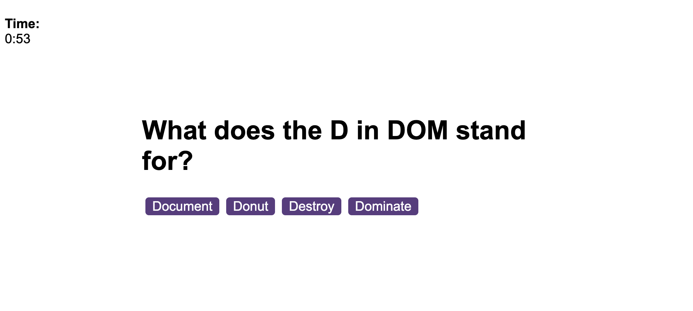
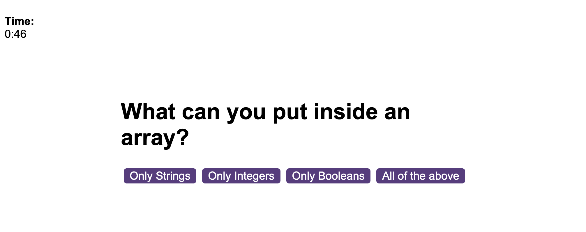
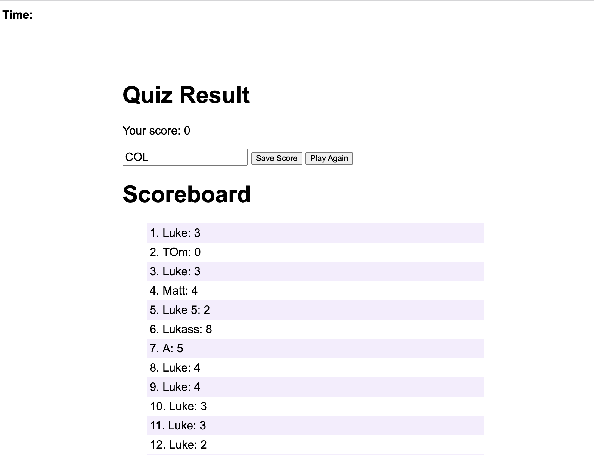

# Coding Quiz Game

## Links
Repo Link:
https://github.com/thelukass88/Coding-Quiz
Deployed Page Link:
https://thelukass88.github.io/Coding-Quiz/

## Description
Using JS, the quiz game loops through 8 questions using multiple choices andwers, that have been put into an array of objects. The game uses local storage to save the scores of the users and input them into a highscores table. The game is playable again after clicking the 'Play Again' button, however, I could not get the timer to restart after a number of tries. The new score does add to the scoreboard. 
## Table of Contents
* [Installation](#installation)
* [Useage](#useage)
* [Licence](#licence)
* [Contributions](#contributors)
* [Testing](#tests)
* [Questions](#questions)
## Images

## Installation
N/A
## Useage
Click 'Start Game' - Answers questions by clicking multiple choice buttons - enter name at the end to store score in highscores table.
## Licence
Your application is licenced under: MIT
## Contributions
N/A
## Tests
N/A
## Questions
If you would like to contact me 
visit: [github/thelukass88](https://github.com/thelukass88) 
email: l.holliday88@hotmail.com